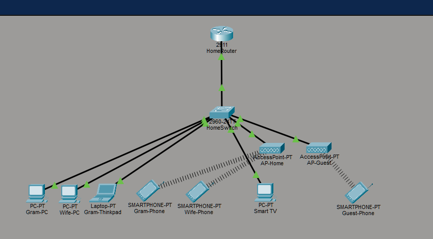
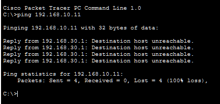
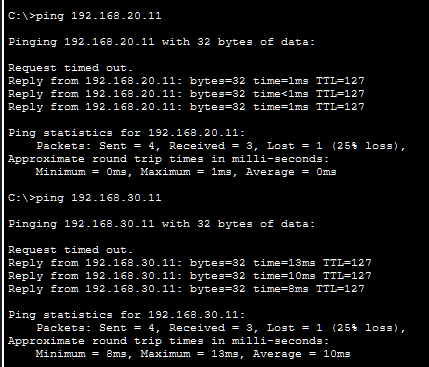

# Home Network VLAN Lab

A segmented home network built in Cisco Packet Tracer. Designed as the blueprint for my planned real-world home setup — separating trusted devices, IoT, and guest access with VLANs and ACLs.

## What this project demonstrates

- VLAN creation and access port assignment
- 802.1Q trunking between switch and router
- Router-on-a-stick (inter-VLAN routing with subinterfaces)
- DHCP pools per VLAN with excluded address ranges
- Extended ACLs to enforce segmentation between VLANs
- Wireless segmentation using separate SSIDs mapped to different VLANs

## Topology



## Network design

| VLAN | Name | Subnet | Gateway | Purpose |
|------|------|--------|---------|---------|
| 10 | Trusted | 192.168.10.0/24 | 192.168.10.1 | Personal PCs, laptop, phones |
| 20 | IoT | 192.168.20.0/24 | 192.168.20.1 | Smart TV (and future smart devices) |
| 30 | Guest | 192.168.30.0/24 | 192.168.30.1 | Visitor devices |

## Security rules (ACLs)

| Source VLAN | Destination | Allowed |
|-------------|-------------|---------|
| Trusted | Anything | ✅ |
| IoT | Trusted | ❌ |
| IoT | Guest / Internet | ✅ |
| Guest | Trusted | ❌ |
| Guest | IoT | ❌ |
| Guest | Internet | ✅ |

The logic: a compromised IoT device (smart TV, future smart plug, etc.) should never be able to reach my personal PCs. A guest on the visitor WiFi should never be able to reach either my internal network or my smart home devices.

## Wireless setup

Packet Tracer's basic AP can only broadcast one SSID per VLAN, so two APs are used in the sim:

- `AP-Home` → SSID `HomeWiFi` → VLAN 10 (Trusted)
- `AP-Guest` → SSID `GuestWiFi` → VLAN 30 (Guest)

In a real-world build, this would collapse into a single capable AP broadcasting multiple SSIDs mapped to different VLANs.

## Configuration

### Switch — VLAN creation

```cisco
vlan 10
 name Trusted
vlan 20
 name IoT
vlan 30
 name Guest
```

### Switch — access port assignments

```cisco
interface range FastEthernet0/1 - 3
 switchport mode access
 switchport access vlan 10

interface FastEthernet0/5
 switchport mode access
 switchport access vlan 10

interface FastEthernet0/15
 switchport mode access
 switchport access vlan 30

interface FastEthernet0/20
 switchport mode access
 switchport access vlan 20
```

### Switch — trunk to router

```cisco
interface GigabitEthernet0/1
 switchport mode trunk
 switchport trunk allowed vlan 10,20,30
```

### Router — subinterfaces (router-on-a-stick)

```cisco
interface GigabitEthernet0/0
 no shutdown

interface GigabitEthernet0/0.10
 encapsulation dot1Q 10
 ip address 192.168.10.1 255.255.255.0

interface GigabitEthernet0/0.20
 encapsulation dot1Q 20
 ip address 192.168.20.1 255.255.255.0

interface GigabitEthernet0/0.30
 encapsulation dot1Q 30
 ip address 192.168.30.1 255.255.255.0
```

### Router — DHCP pools

```cisco
ip dhcp excluded-address 192.168.10.1 192.168.10.10
ip dhcp excluded-address 192.168.20.1 192.168.20.10
ip dhcp excluded-address 192.168.30.1 192.168.30.10

ip dhcp pool TRUSTED
 network 192.168.10.0 255.255.255.0
 default-router 192.168.10.1
 dns-server 8.8.8.8

ip dhcp pool IOT
 network 192.168.20.0 255.255.255.0
 default-router 192.168.20.1
 dns-server 8.8.8.8

ip dhcp pool GUEST
 network 192.168.30.0 255.255.255.0
 default-router 192.168.30.1
 dns-server 8.8.8.8
```

### Router — ACLs

```cisco
ip access-list extended BLOCK_IOT_TO_TRUSTED
 deny ip 192.168.20.0 0.0.0.255 192.168.10.0 0.0.0.255
 permit ip any any

ip access-list extended BLOCK_GUEST_TO_INTERNAL
 deny ip 192.168.30.0 0.0.0.255 192.168.10.0 0.0.0.255
 deny ip 192.168.30.0 0.0.0.255 192.168.20.0 0.0.0.255
 permit ip any any

interface GigabitEthernet0/0.20
 ip access-group BLOCK_IOT_TO_TRUSTED in

interface GigabitEthernet0/0.30
 ip access-group BLOCK_GUEST_TO_INTERNAL in
```

## Verification

**Trusted PC can reach IoT and Guest VLANs:**



**Guest phone blocked from reaching Trusted VLAN:**



The "Destination host unreachable" response confirms the ACL on the router's Guest subinterface is actively dropping traffic destined for the Trusted subnet.

## Files

- `home-network-vlan-lab.pkt` — the Packet Tracer project file. Open in Cisco Packet Tracer to inspect or modify.
- `homelab/` — topology diagram and ping verification screenshots.

## Built with

- Cisco Packet Tracer 8.x
- Cisco IOS 15.0 (switch), 15.1 (router)

## Notes for the real build

When I build this physically, the changes will be:

- One managed switch instead of the simulated 2960 (likely a small 8- or 16-port model)
- Home router/firewall replaced with pfSense or OPNsense on dedicated hardware (Cisco CLI translates conceptually but not syntactically)
- Single capable AP broadcasting both SSIDs instead of two separate APs
- Additional IoT devices added to VLAN 20 as smart home gear comes online

---

Built as part of learning networking fundamentals alongside CompTIA A+ and Security+ studies.
