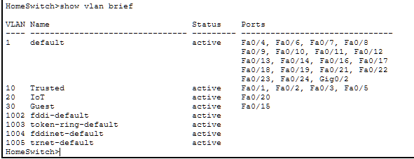
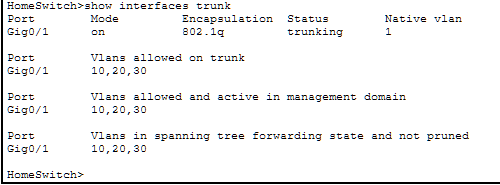
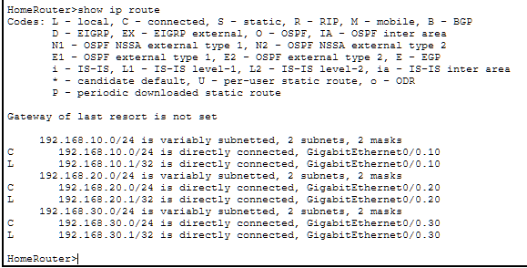
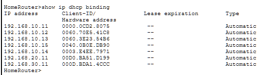
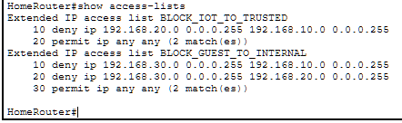

# Home Network VLAN Lab

A segmented home network I built in Cisco Packet Tracer as a learning project. It's also the design I'm planning to actually build in my house once I have the gear — keeping my personal PCs separate from smart devices and guest traffic.

This was my first time touching Cisco IOS, VLANs, or ACLs. I'm an A+ Core 1–certified cybersecurity student studying for Core 2 and then Security+, so everything here I learned while building it.

## What I built

- Three VLANs: Trusted (my stuff), IoT (smart TV + future smart home gear), and Guest (visitors)
- Router-on-a-stick using dot1Q subinterfaces on a single router port to handle traffic between VLANs
- 802.1Q trunk between switch and router, locked down so only my three VLANs can cross it
- DHCP pools on the router so each VLAN hands out IPs from its own subnet
- Extended ACLs to stop IoT and Guest devices from reaching my personal network
- Two wireless APs with different SSIDs — one for home, one for guests

## Topology


## Network design

| VLAN | Name | Subnet | Gateway | Purpose |
|------|------|--------|---------|---------|
| 10 | Trusted | 192.168.10.0/24 | 192.168.10.1 | My PCs, laptop, and phones |
| 20 | IoT | 192.168.20.0/24 | 192.168.20.1 | Smart TV, future smart home stuff |
| 30 | Guest | 192.168.30.0/24 | 192.168.30.1 | Visitors' phones |

## Security rules (ACLs)

| Source VLAN | Destination | Allowed |
|-------------|-------------|---------|
| Trusted | Anything | ✅ |
| IoT | Trusted | ❌ |
| IoT | Guest / Internet | ✅ |
| Guest | Trusted | ❌ |
| Guest | IoT | ❌ |
| Guest | Internet | ✅ |

My reasoning: if something on the smart TV or a future smart plug ever gets compromised, it shouldn't be able to reach my actual computers. And guests on the visitor WiFi definitely shouldn't be able to see my personal network or my smart devices.

I applied the ACLs inbound on the Guest and IoT subinterfaces. I read that you can filter inbound or outbound, and inbound made more sense to me — drop the bad traffic right as it hits the router instead of letting it get routed first and then deciding.

## About the trunk

The cable between the switch and the router carries all three VLANs, so it's a trunk. By default Cisco trunks allow every VLAN to cross, which I learned isn't great — if you ever added more VLANs later, they'd ride the trunk too whether you wanted them to or not. I restricted mine to only VLANs 10, 20, and 30.

## About the wireless

Packet Tracer's basic AP can only broadcast one SSID and sit in one VLAN, so I used two APs in the sim — `AP-Home` for Trusted and `AP-Guest` for Guest. On real gear I'd just use one AP that can broadcast multiple SSIDs mapped to different VLANs. A lot of home routers can do this now.

## Configuration

These are the actual commands I ran. I left them here so anyone looking at the repo can see exactly what the network is built from without having to open the .pkt file.

### Switch — create the VLANs

```cisco
vlan 10
 name Trusted
vlan 20
 name IoT
vlan 30
 name Guest
```

### Switch — put ports in VLANs

```cisco
interface range FastEthernet0/1 - 3
 switchport mode access
 switchport access vlan 10

interface FastEthernet0/5
 switchport mode access
 switchport access vlan 10

interface FastEthernet0/15
 switchport mode access
 switchport access vlan 30

interface FastEthernet0/20
 switchport mode access
 switchport access vlan 20
```

### Switch — trunk to the router

```cisco
interface GigabitEthernet0/1
 switchport mode trunk
 switchport trunk allowed vlan 10,20,30
```

### Router — subinterfaces (router-on-a-stick)

```cisco
interface GigabitEthernet0/0
 no shutdown

interface GigabitEthernet0/0.10
 encapsulation dot1Q 10
 ip address 192.168.10.1 255.255.255.0

interface GigabitEthernet0/0.20
 encapsulation dot1Q 20
 ip address 192.168.20.1 255.255.255.0

interface GigabitEthernet0/0.30
 encapsulation dot1Q 30
 ip address 192.168.30.1 255.255.255.0
```

### Router — DHCP for each VLAN

```cisco
ip dhcp excluded-address 192.168.10.1 192.168.10.10
ip dhcp excluded-address 192.168.20.1 192.168.20.10
ip dhcp excluded-address 192.168.30.1 192.168.30.10

ip dhcp pool TRUSTED
 network 192.168.10.0 255.255.255.0
 default-router 192.168.10.1
 dns-server 8.8.8.8

ip dhcp pool IOT
 network 192.168.20.0 255.255.255.0
 default-router 192.168.20.1
 dns-server 8.8.8.8

ip dhcp pool GUEST
 network 192.168.30.0 255.255.255.0
 default-router 192.168.30.1
 dns-server 8.8.8.8
```

I reserved the first 10 IPs in each subnet so they're not handed out by DHCP — figured I'd want room for static stuff later (router, printer, maybe a server someday).

### Router — ACLs

```cisco
ip access-list extended BLOCK_IOT_TO_TRUSTED
 deny ip 192.168.20.0 0.0.0.255 192.168.10.0 0.0.0.255
 permit ip any any

ip access-list extended BLOCK_GUEST_TO_INTERNAL
 deny ip 192.168.30.0 0.0.0.255 192.168.10.0 0.0.0.255
 deny ip 192.168.30.0 0.0.0.255 192.168.20.0 0.0.0.255
 permit ip any any

interface GigabitEthernet0/0.20
 ip access-group BLOCK_IOT_TO_TRUSTED in

interface GigabitEthernet0/0.30
 ip access-group BLOCK_GUEST_TO_INTERNAL in
```

The `permit ip any any` at the end of each ACL is important — without it, the implicit deny at the end of every Cisco ACL would drop everything else too, including normal internet traffic. Learned that one the hard way.

## Testing — does it actually work

I ran pings between every combination of VLANs to make sure the ACLs were doing their job.

| Source | Destination | Should it work? | Did it work? |
|--------|-------------|-----------------|--------------|
| Trusted (Gram-PC) | IoT (Smart-TV) | Yes | ✅ Yes |
| Trusted (Gram-PC) | Guest (Guest-Phone) | Yes | ✅ Yes |
| IoT (Smart-TV) | Trusted (Gram-PC) | No | ❌ Blocked |
| Guest (Guest-Phone) | Trusted (Gram-PC) | No | ❌ Blocked |
| Guest (Guest-Phone) | IoT (Smart-TV) | No | ❌ Blocked |

**Trusted PC can reach IoT and Guest:**


**Guest phone blocked from reaching Trusted:**


The "Destination host unreachable" is the router telling the Guest phone "nope, that's blocked" — which is exactly what I wanted.

## Checking the config with show commands

Pings prove the network *behaves* correctly. These `show` commands prove the config is actually in place underneath.

### `show vlan brief` on the switch

Confirms the three VLANs exist and which ports are in each one:



### `show interfaces trunk` on the switch

Confirms the router uplink is actually running as a trunk and is only carrying the three VLANs I allowed:



### `show ip route` on the router

Confirms the router knows how to reach all three subnets via the subinterfaces:



### `show ip dhcp binding` on the router

Confirms DHCP actually handed out IPs to the right VLANs — you can see addresses in each of the three subnets:



### `show access-lists` on the router

Confirms both ACLs are loaded and shows the hit counter, so I know the rules are actually matching traffic instead of just sitting there:



## Files

- `home-network-vlan-lab.pkt` — the Packet Tracer file. Open it in Packet Tracer if you want to click around the config yourself.
- `homelab/` — topology and verification screenshots.

## Built with

- Cisco Packet Tracer 8.x
- Cisco IOS 15.0 (switch), 15.1 (router)

## When I build this for real

A few things will change going from the sim to actual hardware:

- I'll probably use a real managed switch (something small, 8 or 16 ports)
- Instead of a Cisco router, I'll likely run pfSense or OPNsense on a mini PC. The concepts are the same but the commands aren't — I'll be clicking through a web GUI instead of typing IOS commands.
- One AP broadcasting both SSIDs instead of two separate APs
- More devices getting added to the IoT VLAN as I pick up smart home gear

---

Built while working on CompTIA A+ and studying for Security+. First real networking project I've done from scratch.
